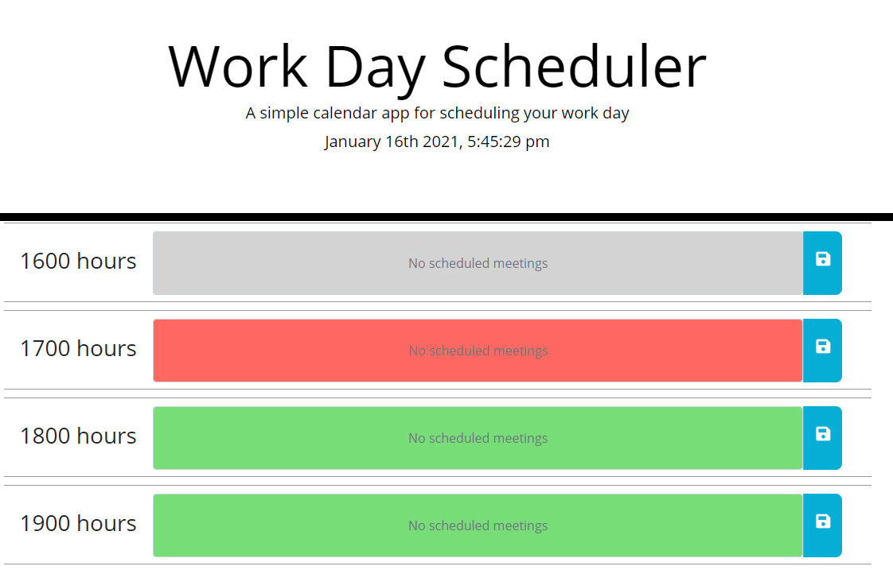
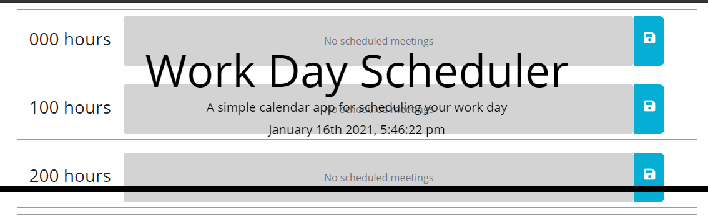
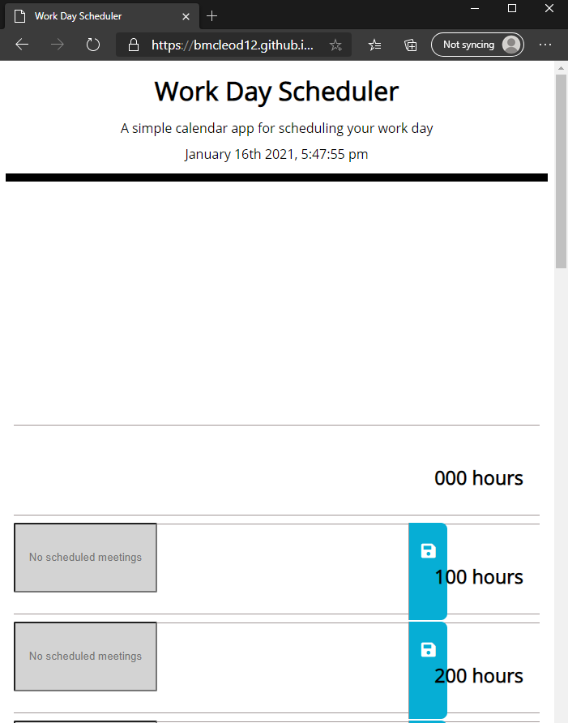

# Work Day Scheduler
I know I'm taking a hit for this assignment - I'm completely stuck on how to add the schedule text into the localStorage. I've watched videos, tried everything I could, and just can't figure it out.  The screen also doesn't load with the current hour at the top. Just out of stamina; maybe when I'm a better developer I'll be able to figure it out.

https://bmcleod12.github.io/working-for-the-weekend/

## Description
This project was intended to create a simple calendar application that allows a user to save events for each hour of the day. It uses HTML, CSS, and jQuery. It does not fuction entirely as designed, but it's halfway there.

## Usage
Follow this link: https://bmcleod12.github.io/working-for-the-weekend/ and you will land on a screen that displays a time block for each hour of the day.

The blocks are color-coded to display grey for time in the past; red for the current hour; and green for time in the future.

Unfortunately, nothing happens when you click the Save icon for the time being, but hopefully that functionality is forthcoming.

## Known Issues
Aside from the obvious issues around the save icon not working (check out the console log to see the crazy array it's trying to create), when this link is loaded in Chrome, for some reason the header is still transparent and there is no margin at the top of the container as there should be. This is not an issue in IE/Edge.

There is anotehr issue where upon first load in a browser, the bootsrap/jQuery references do not load immediately, and the formatting is off. Refreshing the page a couple of times seems to resolve this issue.

## License

MIT License

Copyright (c) 2021 KU Boot Camp

Permission is hereby granted, free of charge, to any person obtaining a copy
of this software and associated documentation files (the "Software"), to deal
in the Software without restriction, including without limitation the rights
to use, copy, modify, merge, publish, distribute, sublicense, and/or sell
copies of the Software, and to permit persons to whom the Software is
furnished to do so, subject to the following conditions:

The above copyright notice and this permission notice shall be included in all
copies or substantial portions of the Software.

THE SOFTWARE IS PROVIDED "AS IS", WITHOUT WARRANTY OF ANY KIND, EXPRESS OR
IMPLIED, INCLUDING BUT NOT LIMITED TO THE WARRANTIES OF MERCHANTABILITY,
FITNESS FOR A PARTICULAR PURPOSE AND NONINFRINGEMENT. IN NO EVENT SHALL THE
AUTHORS OR COPYRIGHT HOLDERS BE LIABLE FOR ANY CLAIM, DAMAGES OR OTHER
LIABILITY, WHETHER IN AN ACTION OF CONTRACT, TORT OR OTHERWISE, ARISING FROM,
OUT OF OR IN CONNECTION WITH THE SOFTWARE OR THE USE OR OTHER DEALINGS IN THE
SOFTWARE.